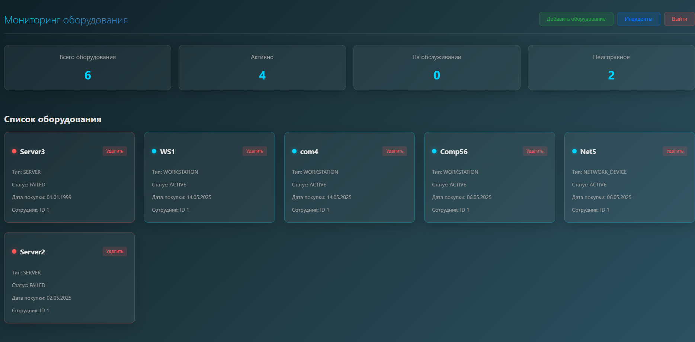
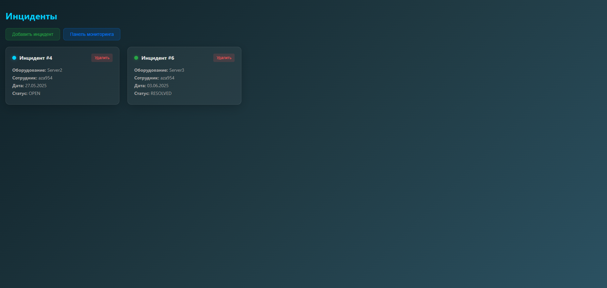
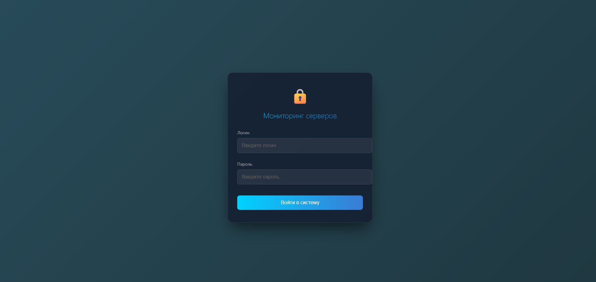

Equipment Maintenance System 📌 Описание проекта Equipment Maintenance System — это веб-приложение для мониторинга состояния оборудования и управления инцидентами. Оно позволяет:

Просматривать список оборудования 📊

Добавлять новое оборудование 🛠️

Управлять статусами оборудования 🔄

Отслеживать инциденты, связанные с оборудованием 🚨

Добавлять и удалять инциденты ⚡

Использовать кеширование Redis для оптимизации запросов 🔥

🔧 Технологии Бэкенд (Spring Boot + Redis) Spring Boot (REST API, Security, JPA)

Spring Security (Аутентификация и авторизация)

Spring Data JPA (Работа с базой данных)

Spring Cache + Redis (Кэширование запросов)

PostgreSQL (Основная БД)

Swagger (Документирование API)

Lombok (Упрощение кода)

JUnit, Mockito (Тестирование)

Фронтенд (React) React + React Router (Клиентская часть)

Фронт:

